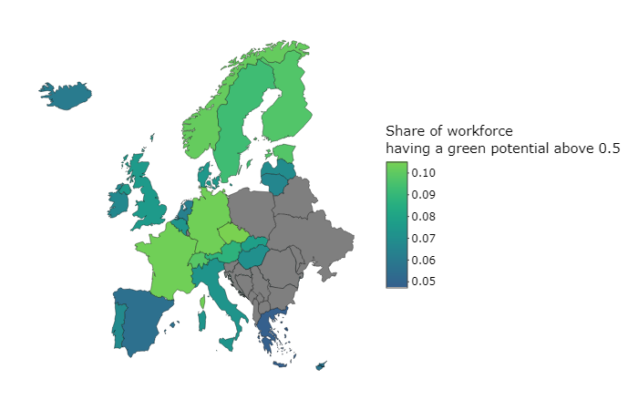

# The Green Transition and the Labor Market - An Interactive Analysis

This repository contains all non-confidential data and all the corresponding code for an interactive analysis on the 'green potential' of ISCO occupations and its implications for a ***Green Transition*** in Switzerland and European countries.
The results are presented and discussed at https://cieb.shinyapps.io/nrp_73_green_potential/

This work has been supported by the Swiss National Science Foundation (SNSF) within the framework of the National Research Program "Sustainable Economy: resource-friendly, future-oriented, innovative" (NRP 73) Grant-No 407340-172430.

## Structure

### Data Creation
This folder contains all the non-confidential raw data and all the corresponding code to generate the data used for our analysis. 

### Report
This is where the code for the interactive analysis is available (the file `nrp_73_green_potential.Rmd`). 

### Example
<!-- -->

