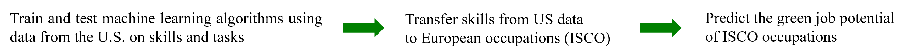

```{r setup, include=FALSE}
knitr::opts_chunk$set(echo = TRUE)
library(shiny)
library(ggplot2)
library(xtable)
library(DT)
library(viridis)
library(RColorBrewer)
library(knitr)
library(png)
library(cowplot)
library(plotly)
library(viridis)
library(autoimage)
library(shinyWidgets)
```

<br>

[{ width=18% }](http://cieb.unibas.ch/)&nbsp;&nbsp;
[{ width=25% }](http://www.nrp73.ch/)&nbsp;
[{ width=25% }](http://www.snf.ch/)&nbsp;&nbsp;
[{ width=12% }](http://www.bss-basel.ch/)&nbsp;&nbsp;

<<<<<<< HEAD
#### <font color='green'>**Transition to a "Green Open Economy": Labour Market Effects and Implications for the Swiss Economy** </font>

*February 2020. By [Matthias Niggli](https://wwz.unibas.ch/de/personen/matthias-niggli/) and [Christian Rutzer](https://wwz.unibas.ch/de/personen/christian-rutzer/)*
TEST
=======
## <font color="green"> **Greening and the Labor Market** </font>
>>>>>>> c61f93692fe189a7dbb68b4049a6c5e5d53f9cf3

*Mai 2020*

<a href="https://cieb.unibas.ch/de/team/matthias-niggli/" target = "_blank">Matthias Niggli</a> and 
<a href="https://cieb.unibas.ch/de/team/dr-christian-rutzer/" target = "_blank">Christian Rutzer</a>


<br>

Think about a country that decides to transform towards a greener and more sustainable economy. Such a Green Transition is a major structural change which is likely to induce shifts in the demand for products and technologies. At the same time, of course, it has also an effect on labor markets. For example, skills requirements in some occupations are likely to change (e.g. knowledge of electro engines instead), the demand for green tasks increases (e.g. installations of solar panels) and rather pollution-intensive tasks might vanish completely over the long run (e.g. coal mining). An important concern is therefore whether labor markets can cope with these implied changes (see for example work from Vona et al. 2018; Bowen et al., 2016; Consoli et al. 2016 or Martinez-Fernandez et al., 2010).


We have investigated questions like this in a reserach project, which is funded by the Swiss National Science Foundation (SNF/NRP-73). With this report, we provide an overview of the project’s main findings and discuss some of the possible implications for the Swiss economy. 

<br>

#### <font color='green'> **The Green Potential of Occupations** </font>


```{r, echo = F}
# get the data:
isco_list <- read.csv2("isco_list.csv")
isco_list <- mutate(isco_list, ISCO = as.character(ISCO), green = as.numeric(as.character(green)))
colnames(isco_list) <- c("ISCO", "Occupation", "Estimated Green Potential")

# make the table
renderDT(
        datatable(isco_list,
                  class = "display nowrap compact", # style
                  filter = "top", # location of column filters
                  rownames= FALSE,
                  options = list(pageLength = 20, dom = 'tp', 
                                 columnDefs=list(list(targets=0:2, className="dt-left")))) %>% 
                formatStyle(columns = c("Estimated Green Potential"), target = "row",
                            backgroundColor = styleInterval(seq(0, 1, 0.05),
                                                            colorRampPalette(c(rgb(0, 0, 0.1, 0.1),
                                                                               rgb(0, 0.9 , 0, 0.5)), 
                                                                             alpha = TRUE)(22)))
        )
```
<span style="font-size:0.8em">*Source: Own estimations of <a href="http://cieb.unibas.ch/" target = "_blank">CIEB</a> based on <a href="https://www.onetonline.org/" target ="blank">O\*NET</a> data. The data is available on  [GitHub](https://github.com/matthnig/green-potential).*</span>

```{r, echo = F}
# prepare the data for the map ----------------------------------------------
plot.data <- readRDS("data_section2.rds")
plot.data <- data.frame(plot.data) 
mydata <- reactive({
  plot.data_sub <- dplyr::filter(plot.data, dplyr::near(cut_off, input$cut))
  head(plot.data_sub)
  plot.data_sub
  })
```

<br>

```{r, echo = F}
# make a slider input for the treshold ----------------------------------------------
sliderInput("cut",
            width = '100%',
            label="Choose a green potential threshold",
            min=0.40000,
            max=0.80000,
            value=0.5000000,
            step=0.0500000)

# make the reactive plot ----------------------------------------------
renderPlotly({
        
        # get the data according to the cut-off:
        dat <- mydata()
	dat <- mutate(dat, 
	              share_green = round(share_green, 4), 
	              Country = paste0(region, ' ', round(share_green*100, 0), ' %'))
	
	cut_value <- input$cut
	col.range <- c(unique(min(plot.data$share_green, na.rm = T)), 
	               unique(max(plot.data$share_green, na.rm = T)))
	col.range= c(0, 0.5)
	
	ggplotly(
	        ggplot2::ggplot()+
	                geom_polygon(data = dat, 
	                             aes(x = long, y = lat, group = group, fill = share_green, label = Country),
	                             color="black",size=0.1)  +
	                scale_fill_viridis(option = "viridis", begin = 0.3, end = 0.8, 
	                                   name= paste0("Share of workforce\nhaving a green potential above ", cut_value)) +
	                theme(legend.position = 'top',
	                      panel.grid.minor =  element_blank(),
	                      panel.background = element_blank(),
	                      axis.title = element_blank(),
	                      axis.text = element_blank(),
	                      axis.ticks = element_blank()
	                      ),
	        tooltip = c("label"), dynamicTicks = T) %>% 
	        config(displayModeBar = T) %>% 
	        layout(xaxis=list(fixedrange=TRUE)) %>% 
	        layout(yaxis=list(fixedrange=TRUE))
	})
```
<span style="font-size:0.8em">*Source: Own calcualations based on the <a href="https://ec.europa.eu/eurostat/web/microdata/european-union-labour-force-survey" target = "_blank">European Union Labour Force Survey</a> and our green potential estimates of occupations.*</span>


<br>
```{r, echo = F}
renderText({
    dat <- mydata()
    paste0("   ",
    "When setting the cut-off to ", input$cut, ", ", round(unique(dat[dat$iso == "CHE", "share_green"])*100, 0),
    "% of Switzerland's workforce has a green potential above this value. In comparison, the country with the largest share is ", unique(dat[which(max(dat$share_green)==dat$share_green), "region"])," with ", round(unique(dat[which(max(dat$share_green)==dat$share_green), "share_green"])*100, 0), "% of it's workforce above that cut-off. The country with the lowest share is ", unique(dat[which(min(dat$share_green)==dat$share_green), "region"]), ifelse(round(unique(dat[which(min(dat$share_green)==dat$share_green), "share_green"])*100,0)==0, paste0(" with nearly zero percent."), paste0(" with a share of ", round(unique(dat[which(min(dat$share_green)==dat$share_green), "share_green"])*100, 0), "%.")))
})
```

<br>

#### <font color='green'> **The Green Transition in Switzerland** </font>


<font color='red'> PROBLEM: SHORTAGE INDICATOR NOT AVAILABLE FOR A LOT OF OCCUPTIONS -> MICHAEL FRAGEN</font>

MN: Habe gemerkt, dass ich dasselbe Problem habe. Ich habe bei Michael angefragt als ich mit dem Sammelband begann und habe von ihm dieses .csv hier bekommen: *./Dropbox/NFP 73/Output/paper green potential in europe/Daten/indicators-4digit.xlsx*
Mir gibt es da 277 ISCOs an. Für green.potential habe ich diese Liste verwendet: *./Dropbox/NFP 73 (WWZ intern)/Daten/ISCO/isco_list.csv*. Hier komme ich auf 323 iscos 

=> 46 Missings bei Michaels Daten.

=> unbedingt darauf achten, dass wir uns hier auf die gleichen Daten beziehen!!!

<br>

```{r, echo = F}
sec3_dat <- readRDS("data_section3.rds")
renderDT(
        datatable(sec3_dat, 
                  class = "display nowrap compact", # style
                  filter = "top", # location of column filters
                  rownames= FALSE,
                  # fillContainer = FALSE,
                  options = list(pageLength = 20, dom = 'tp', 
                                 columnDefs=list(list(targets=0:3, className="dt-left")))) %>% 
                formatStyle(columns = c("Estimated Green Potential"), target = "row",
                            backgroundColor = styleInterval(seq(0, 1, 0.05),
                                                            colorRampPalette(c(rgb(0, 0, 0.1, 0.1),
                                                                               rgb(0, 0.9 , 0, 0.5)), 
                                                                             alpha = TRUE)(22))
                            )
        )
```
<span style="font-size:0.8em">*Source: Own estimations of <a href="http://cieb.unibas.ch/" target = "_blank">CIEB</a> based on data from <a href="https://www.onetonline.org/" target ="blank">O\*NET</a> and <a href="https://bss-basel.ch/de/einblicke/fachkraefteindex" target ="blank">BSS</a>.*</span>

<br>

```{r, echo = F}
#### load the data and define input parameters for plotting -------------------------------------------------
sec4_dat <- readRDS("data_section4.rds")
REGIONEN <- as.character(unique(sec4_dat$Region))
NOGAS <- unique(sec4_dat$NOGA2digit)
NOGAS_NAMES <- unique(sec4_dat$NOGAS_NAMES)
plot1_data <- subset(sec4_dat, 
                     NOGA2digit %in% NOGAS & 
                             NOGA2digit != 24 & # discard outlier
                             THRES == 0.4 & # set a random threshold. plot does not depend on it
                             Region == "Schweiz")

# make the plot: 
renderPlotly({
        ggplotly(
                ggplot(data = plot1_data, aes(x = Handelbarkeit, y= log(GHG_per_ValueAdded),
                                              color = log(GHG_per_ValueAdded)))+
                geom_point(size = 4, alpha = 0.7)+
                geom_text(aes(label = NOGA2digit), size = 3, check_overlap = FALSE, nudge_x = +0.08, nudge_y = +0.05)+
                xlab("Tradeability")+
                ylab("Greenhouse gas emissions per value added")+
                scale_color_viridis(option="viridis", begin = 0.7, end = 0.5, discrete = FALSE, name = "None")+
                guides(color = FALSE)+
                theme(axis.title = element_text(face="bold",size=10),
                      panel.background = element_blank(),
                      axis.line = element_line()
                      ),
                tooltip = c("label"), dynamicTicks = T) %>%
                config(displayModeBar = T) %>% 
                layout(xaxis=list(fixedrange=TRUE)) %>% 
                layout(yaxis=list(fixedrange=TRUE))
        })
```
<span style="font-size:0.8em">*Source: Own estimations of <a href="http://cieb.unibas.ch/" target = "_blank">CIEB</a> based on data from <a href="https://ec.europa.eu/eurostat/cache/metadata/de/env_ac_ainah_r2_esms.htm" target ="blank">Eurostat</a>, <a href="http://www.oecd.org/sti/ind/stanstructuralanalysisdatabase.htm" target ="blank">OECD</a> and <a href="https://www.ezv.admin.ch/ezv/en/home/topics/swiss-foreign-trade-statistics/daten.html" target ="blank">Swiss Federal Customs Administration</a>.*</span>

<br>

```{r, echo = F}
# define the input panels: -------------------------------------------------------------------------
fluidRow(
        column(4,
pickerInput(
  inputId = "REGIONEN", 
  label = "Choose a region", 
  choices = REGIONEN, 
  selected = "Schweiz",
  options = list(
    `actions-box` = TRUE, 
    `selected-text-format` = "count > 3",
    `count-selected-text` = "Alle",
    `deselect-all-text` = "Discard all",
    `select-all-text` = "Seclect all",
    `none-selected-text` = 'No regions selected'), 
  multiple = FALSE)
),
column(4,
pickerInput(
  inputId = "NOGAS_NAMES", 
  label = "Choose industries", 
  choices = NOGAS_NAMES, 
  selected = NOGAS_NAMES,
  options = list(
    `actions-box` = TRUE, 
    size = 10,
    `selected-text-format` = "count > 3",
    `count-selected-text` = "All",
    `deselect-all-text` = "Discard all",
    `select-all-text` = "Select all",
    `none-selected-text` = 'No industries selected'), 
  multiple = TRUE)
)
)

# make a slider input for the treshold ----------------------------------------------
sliderInput("cutOff",
            width = '100%',
            label="Choose a green potential threshold",
            min=0.40000,
            max=0.80000,
            value=0.5000000,
            step=0.0500000)
```

```{r, echo = F}
# define the output panel : -------------------------------------------------------------------------
renderPlotly({
                
        # subset the data accoding to the input:
        
        NOGAS <- sec4_dat[sec4_dat$NOGAS_NAMES %in% input$NOGAS_NAMES, "NOGA2digit"] # get selected NOGA codes
        
        plot2_data <- subset(sec4_dat,
               round(THRES, 2) == input$cutOff & # selected cutOff (use round() to make sure numbers match)
               Region %in% input$REGIONEN & # selected Region(s)
               NOGA2digit %in% NOGAS # selected NOGA codes 
               )

        # make the plot
        ggplotly(
                ggplot(data = plot2_data, aes(x = green_emp_share, y= WeightedShortageGreen ))+
                geom_point(color = "blue4", size = 4, alpha = 0.7)+
                geom_text(aes(label = NOGA2digit), size = 3, check_overlap = FALSE, nudge_x = +0.01, nudge_y = +0.02)+
                xlab(paste("Employment share of jobs with  green potential \n (Region: ",
                           paste0(input$REGIONEN, collapse = " & "),
                           ", green potential of at least ",input$cutOff,")", sep=""))+
                ylab(paste("Shortage of jobs with green potential \n (Region: ", 
                           paste0(input$REGIONEN, collapse = " & "),
                           ", green potential of at least ", input$cutOff,")",sep = ""))+
                ylim(-0.5, 7)+
                xlim(0, 0.5)+
                guides(color = FALSE)+
                theme(axis.title = element_text(face="bold",size = 10),
                      panel.background = element_blank(),
                      axis.line = element_line()
                      ),
                
                tooltip = c("label"), dynamicTicks = T) %>%
                config(displayModeBar = T) %>% 
                layout(xaxis = list(fixedrange=TRUE)) %>% 
                layout(yaxis = list(fixedrange=TRUE))
        })
```
<span style="font-size:0.8em">*Source: Own estimations of <a href="http://cieb.unibas.ch/" target = "_blank">CIEB</a> based on data from <a href="https://www.bfs.admin.ch/bfs/en/home/statistics/work-income/surveys/slfs.html" target ="blank">Federal Statistical Office</a> and <a href="https://bss-basel.ch/de/einblicke/fachkraefteindex" target ="blank">BSS</a>.*</span>

<br>
<br>

<hr>

#### **Methodology**
For a detailed description, we refer to a recent [Working Paper](https://ideas.repec.org/p/bsl/wpaper/2020-03.html) of us. In short, the green potential of an occupation depends on whether it can fulfill the tasks that are demanded in a green economy. This, in turn, depends on the skills that workers possess. The <a href="https://www.onetcenter.org/reports/GreenTask.html" target = "_blank">O*NET</a> database features information on “green tasks” as well as on skills for every U.S. occupation classified according to the <a href="https://www.bls.gov/soc/" target = "_blank">SOC classification</a>. 
Using the skill values as input features $X_i$ and the number of green tasks as the outcome $Y_i$  allows us to train machine learning algorithms that predict the “green potential” of U.S. occupations. We have trained four standard algorithms: <a href="https://en.wikipedia.org/wiki/Ordinary_least_squares" target = "_blank">Simple OLS</a>, <a href="https://en.wikipedia.org/wiki/Lasso_(statistics)" target = "_blank">LASSO</a>, <a href="https://en.wikipedia.org/wiki/Random_forest">Random Forest</a> and <a href="https://en.wikipedia.org/wiki/Tikhonov_regularization" target = "_blank">Ridge regression</a>, among which the Ridge regression showed the best prediction performance.

<br>

<figure> 
<figcaption> *How to estimate the green potential of occupations* </figcaption>
  
</figure>

<br>

Certainly, the green transition is not a U.S. specific phenomenon and, therefore, we have also evaluated the “green potential” of <a href="https://www.ilo.org/public/english/bureau/stat/isco/" target = "_blank">ISCO occupations</a>. ISCO is a classification scheme that is used worldwide and, in particular, also in Switzerland. We have used a crosswalk between the U.S. SOC classification and the ISCO classification to transfer skill values of U.S. occupations from the O*NET database to ISCO occupations. With this, we have obtained skills values for ISCO occupations, which we then used as input variables $X_i$ in our trained Ridge regression to predict the “green potential” of ISCO occupations.

<hr>

