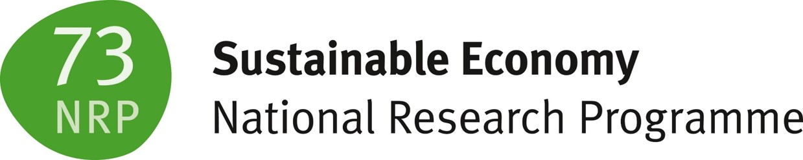

```{r setup, include=FALSE}
knitr::opts_chunk$set(echo = TRUE)
library(shiny)
library(ggplot2)
library(xtable)
library(DT)
library(viridis)
library(RColorBrewer)
library(knitr)
library(png)
library(cowplot)
library(plotly)
library(viridis)
library(autoimage)
library(shinyWidgets)
```

<head>
<!-- Global site tag (gtag.js) - Google Analytics -->
<script async src="https://www.googletagmanager.com/gtag/js?id=UA-71167447-1"></script>
<script>
  window.dataLayer = window.dataLayer || [];
  function gtag(){dataLayer.push(arguments);}
  gtag('js', new Date());
  gtag('config', 'UA-71167447-1');
</script>
</head>


<br>

[{ width=18% }](http://cieb.unibas.ch/)&nbsp;&nbsp;
[{ width=25% }](http://www.nrp73.ch/)&nbsp;
[{ width=25% }](http://www.snf.ch/)&nbsp;&nbsp;

## <font color="green"> **Greening and the Labor Market** </font>

*Mai 2020* <a href="https://cieb.unibas.ch/de/team/matthias-niggli/" target = "_blank">Matthias Niggli</a> and <a href="https://cieb.unibas.ch/de/team/dr-christian-rutzer/" target = "_blank">Christian Rutzer</a>


<br>

Think about a country that decides to transform towards a greener and more sustainable economy. Such a Green Transition is a major structural change which is likely to induce shifts in the demand for products and technologies. At the same time, of course, it has also an effect on labor markets. For example, skills requirements in some occupations are likely to change (e.g. knowledge of electro engines instead), the demand for green tasks increases (e.g. installations of solar panels) and rather pollution-intensive tasks might vanish completely over the long run (e.g. coal mining). An important concern is therefore whether labor markets can cope with these implied changes (see for example work from Vona et al. 2018; Bowen et al., 2016; Consoli et al. 2016 or Martinez-Fernandez et al., 2010).


We have investigated questions like this in a reserach project, which is funded by the Swiss National Science Foundation (SNF/NRP-73). With this report, we provide an overview of the project’s main findings and discuss some of the possible implications for the Swiss economy. 

<br>

#### <font color='green'> **The Green Potential of Occupations** </font>


```{r, echo = F}
# get the data:
isco_list <- readRDS("data_section1&3.rds")
isco_green <- isco_list[["isco_green"]]

# make the table
renderDT(
        datatable(isco_green,  extensions = 'Scroller',
                  class = "display nowrap compact", # style
                  filter = "top", # location of column filters
                  rownames= FALSE,
                  options = list(scrollY = 180, scroller = TRUE, pageLength = 20, dom = 'tp', 
                                 columnDefs=list(list(targets=0:2, className="dt-left")))) %>% 
                formatStyle(0:3, target = "row", 
                            backgroundColor = styleInterval(seq(0,1,0.05),
                                                            colorRampPalette(c(rgb(0,0,0.1,0.1),
                                                                               rgb(0,1,0,0.7)), alpha=TRUE)(22)))
        )
```
<span style="font-size:0.8em">*Source: Own estimations of <a href="http://cieb.unibas.ch/" target = "_blank">CIEB</a> based on <a href="https://www.onetonline.org/" target ="blank">O\*NET</a> data.  All the data is available on  [GitHub](https://github.com/matthnig/green-potential).*</span>

```{r, echo = F}
# prepare the data for the map ----------------------------------------------
plot.data <- readRDS("data_section2.rds")
plot.data <- data.frame(plot.data) 
mydata <- reactive({
  plot.data_sub <- dplyr::filter(plot.data, dplyr::near(cut_off, input$cut))
  head(plot.data_sub)
  plot.data_sub
  })
```

<br>

```{r, echo = F}
# make a slider input for the treshold ----------------------------------------------
sliderInput("cut",
            width = '100%',
            label="Choose a green potential threshold",
            min=0.40000,
            max=0.80000,
            value=0.5000000,
            step=0.0500000)

# make the reactive plot ----------------------------------------------
renderPlotly({
        
        # get the data according to the cut-off:
        dat <- mydata()
	dat <- mutate(dat, 
	              share_green = round(share_green, 4), 
	              Country = paste0(region, ' ', round(share_green*100, 0), ' %'))
	
	cut_value <- input$cut
	col.range <- c(unique(min(plot.data$share_green, na.rm = T)), 
	               unique(max(plot.data$share_green, na.rm = T)))
	col.range= c(0, 0.5)
	
	ggplotly(
	        ggplot2::ggplot()+
	                geom_polygon(data = dat, 
	                             aes(x = long, y = lat, group = group, fill = share_green, label = Country),
	                             color="black",size=0.1)  +
	                scale_fill_viridis(option = "viridis", begin = 0.3, end = 0.8, 
	                                   name= paste0("Share of workforce\nhaving a green potential above ", cut_value)) +
	                theme(legend.position = 'top',
	                      panel.grid.minor =  element_blank(),
	                      panel.background = element_blank(),
	                      axis.title = element_blank(),
	                      axis.text = element_blank(),
	                      axis.ticks = element_blank()
	                      ),
	        tooltip = c("label"), dynamicTicks = T) %>% 
	        config(displayModeBar = T) %>% 
	        layout(xaxis=list(fixedrange=TRUE)) %>% 
	        layout(yaxis=list(fixedrange=TRUE))
	})
```
<span style="font-size:0.8em">*Source: Own calcualations based on the <a href="https://ec.europa.eu/eurostat/web/microdata/european-union-labour-force-survey" target = "_blank">European Union Labour Force Survey</a> and our green potential estimates of occupations.*</span>


<br>
```{r, echo = F}
renderText({
    dat <- mydata()
    paste0("   ",
    "When setting the cut-off to ", input$cut, ", ", round(unique(dat[dat$iso == "CHE", "share_green"])*100, 0),
    "% of Switzerland's workforce has a green potential above this value. In comparison, the country with the largest share is ", unique(dat[which(max(dat$share_green)==dat$share_green), "region"])," with ", round(unique(dat[which(max(dat$share_green)==dat$share_green), "share_green"])*100, 0), "% of it's workforce above that cut-off. The country with the lowest share is ", unique(dat[which(min(dat$share_green)==dat$share_green), "region"]), ifelse(round(unique(dat[which(min(dat$share_green)==dat$share_green), "share_green"])*100,0)==0, paste0(" with nearly zero percent."), paste0(" with a share of ", round(unique(dat[which(min(dat$share_green)==dat$share_green), "share_green"])*100, 0), "%.")))
})
```

<br>

#### <font color='green'> **The Green Transition in Switzerland** </font>

<br>

```{r, echo = F}
isco_shortage <- isco_list[["isco_shortage"]]
renderDT(
        datatable(isco_shortage,  extensions = 'Scroller',
                  class = "display nowrap compact", # style
                  filter = "top", # location of column filters
                  rownames= FALSE,
                  options = list(scrollY = 180, scroller = TRUE, scrollX = F, pageLength = 20, dom = 'tp', 
                                 columnDefs=list(list(targets=0:2, className="dt-left")))) %>% 
                formatStyle(3, target = "row", 
                            backgroundColor = styleInterval(seq(0,1,0.05),
                                                            colorRampPalette(c(rgb(0,0,0.1,0.1),
                                                                               rgb(0,1,0,0.7)), alpha=TRUE)(22)))
        )
```
<span style="font-size:0.8em">*Source: <a href="https://bss-basel.ch" target ="blank">BSS</a> and own estimations of <a href="http://cieb.unibas.ch/" target = "_blank">CIEB</a> based on <a href="https://www.onetonline.org/" target ="blank">O\*NET</a> data. All the data is available on  [GitHub](https://github.com/matthnig/green-potential).*</span>

<br>

```{r, echo = F}
#### load the data and define input parameters for plotting -------------------------------------------------
sec4_dat <- readRDS("data_section4.rds")
sec4_dat <- mutate(sec4_dat, NOGAS_NAMES = paste0(NOGA2digit, " ", NOGAS_NAMES))
REGIONEN <- as.character(unique(sec4_dat$Region))
NOGAS <- unique(sec4_dat$NOGA2digit)
NOGAS_NAMES <- unique(sec4_dat$NOGAS_NAMES)
NOGAS_NAMES <- NOGAS_NAMES[NOGAS_NAMES != "D24  Basic metals"] # outlier
plot1_data <- subset(sec4_dat, 
                     NOGA2digit %in% NOGAS & 
                             NOGA2digit != "D24" & # discard outliers
                             THRES == 0.4 & # set a random threshold. plot does not depend on it
                             Region == "Schweiz") %>% mutate(Industry = paste(NOGAS_NAMES, "\nTradeability:", round(Handelbarkeit, 2), "\nGreenhouse gas emissions per value added", round(log(GHG_per_ValueAdded), 2)))

# make the plot: 
renderPlotly({
        ggplotly(
                ggplot(data = plot1_data, aes(x = Handelbarkeit, y= log(GHG_per_ValueAdded),
                                              color = log(GHG_per_ValueAdded), size = Handelbarkeit, label = Industry))+
                geom_point(alpha = 0.7)+
                # geom_text(aes(label = NOGA2digit), size = 3, check_overlap = FALSE, nudge_x = +0.08, nudge_y = +0.05)+
                xlab("Tradeability")+
                ylab("Greenhouse gas emissions per value added\n (in logs)")+
                scale_color_viridis(option="viridis", begin = 0.7, end = 0.4, discrete = FALSE, name = "None")+
                guides(color = FALSE)+
                theme(axis.title = element_text(face="bold",size=10),
                      panel.background = element_blank(),
                      axis.line = element_line()
                      ),
                tooltip = c("label"), dynamicTicks = T) %>%
                config(displayModeBar = F) %>% 
                layout(xaxis=list(fixedrange=TRUE)) %>% 
                layout(yaxis=list(fixedrange=TRUE))
        })

```
<span style="font-size:0.8em">*Source: Own estimations of <a href="http://cieb.unibas.ch/" target = "_blank">CIEB</a> based on <a href="https://www.onetonline.org/" target ="blank">O\*NET</a> data. All the data is available on  [GitHub](https://github.com/matthnig/green-potential).*</span>

<br>

```{r, echo = F}
# define the input panel for industries: -------------------------------------------------------------------------
pickerInput(
  inputId = "NOGAS_NAMES", 
  label = "Choose industries", 
  choices = NOGAS_NAMES, 
  selected = NOGAS_NAMES,
  options = list(
    `actions-box` = TRUE, 
    size = 10,
    `selected-text-format` = "count > 3",
    `count-selected-text` = "All",
    `deselect-all-text` = "Discard all",
    `select-all-text` = "Select all",
    `none-selected-text` = 'No industries selected'), 
  multiple = TRUE)

# make a slider input for the treshold ----------------------------------------------
sliderInput("cutOff",
            width = '100%',
            label="Choose a green potential threshold",
            min=0.40000,
            max=0.80000,
            value=0.5000000,
            step=0.0500000)
```

```{r, echo = F}
# define the output panel : -------------------------------------------------------------------------
renderPlotly({
                
        # subset the data accoding to the input:
        NOGAS <- sec4_dat[sec4_dat$NOGAS_NAMES %in% input$NOGAS_NAMES, "NOGA2digit"] # get selected NOGA codes
        
        plot2_data <- subset(sec4_dat,
               round(THRES, 2) == input$cutOff & # selected cutOff (use round() to make sure numbers match)
               Region == "Schweiz" &
                # Region %in% input$REGIONEN & # selected Region(s)
               NOGA2digit %in% NOGAS & # selected NOGA codes 
               NOGA2digit != "D24"
               ) %>%
                mutate(Industry = paste(NOGAS_NAMES, "\nShare of jobs with green potential:", 
                                        round(green_emp_share, 2), "\nShortage of jobs with green potential:",
                                        round(WeightedShortageGreen, 2), "\nTradeability:", round(Handelbarkeit, 2),
                                        "\nGreenhouse gas emissions per value added (in logs)",
                                        round(log(GHG_per_ValueAdded), 2)
                                        )
                       )

        # make the plot
        ggplotly(
                ggplot(data = plot2_data, aes(x = green_emp_share, y= WeightedShortageGreen, 
                                              label = Industry, color = log(GHG_per_ValueAdded), 
                                              size = Handelbarkeit))+
                geom_point(alpha = 0.7)+
                # geom_text(aes(label = NOGA2digit), size = 4, check_overlap = FALSE, position = position_nudge(y = +0.1))+
                xlab(paste("Employment share of jobs with  green potential in Switzerland \n (green potential of at least",
                           input$cutOff,")", sep=""))+
                ylab(paste("Shortage of jobs with green potential in Switzerland \n (green potential of at least ",
                           input$cutOff,")",sep = ""))+
                ylim(c(-1, 2.5))+
                xlim(c(0, 0.6))+
                guides(color = FALSE)+
                scale_color_viridis(option="viridis", begin = 0.7, end = 0.4, discrete = FALSE, name = "None")+
                theme(axis.title = element_text(face="bold",size = 10),
                      panel.background = element_blank(),
                      axis.line = element_line()
                      ),
                tooltip = c("label"), dynamicTicks = FALSE) %>%
                config(displayModeBar = F) %>% 
                layout(xaxis = list(fixedrange=TRUE)) %>% 
                layout(yaxis = list(fixedrange=TRUE))
        })
```
<span style="font-size:0.8em">*Source: Own estimations of <a href="http://cieb.unibas.ch/" target = "_blank">CIEB</a> based on <a href="https://www.onetonline.org/" target ="blank">O\*NET</a> data.  All the data is available on  [GitHub](https://github.com/matthnig/green-potential).*</span>


